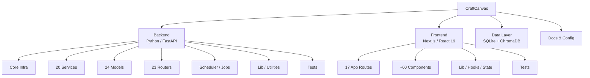

# CraftCanvas — Full Project Evaluation

> **132 Python files** · **124 TypeScript/TSX files** · **~16 design docs**
> Audited: 2026-03-22

---

## Project Sections at a Glance

---

## 1. Backend Core Infrastructure

**Files:** [main.py](file:///Users/oli/Desktop/CraftCanvas/backend/main.py) · [config.py](file:///Users/oli/Desktop/CraftCanvas/backend/config.py) · [database.py](file:///Users/oli/Desktop/CraftCanvas/backend/database.py) · [dependencies.py](file:///Users/oli/Desktop/CraftCanvas/backend/dependencies.py)

| Aspect | Rating | Notes |
|--------|--------|-------|
| Structure | ⭐⭐⭐⭐ | Clean lifespan pattern, well-organized router registration |
| Auth | ⭐⭐⭐ | Supports 3 auth methods (JWT, API key, session cookie) — solid but `session_store` is file-based, not production-safe |
| Config | ⭐⭐⭐ | Plain class with `os.getenv` — works but no validation (Pydantic `BaseSettings` would be stronger) |
| Error Handling | ⭐⭐⚡ | Global exception handler has a **bug** — request-ID middleware is defined *inside* the handler function (dead code, lines 80-94) |

> [!WARNING]
> **Dead Code Bug in `main.py`**: The request-ID middleware on lines 80-94 is nested inside `global_exception_handler` and will **never execute**. It needs to be moved to the module level.

### Key Strengths
- Lifespan context manager properly manages startup/shutdown (DB init, scheduler, Telegram bot)
- Multi-auth system is well-layered with JWT → API Key → Cookie fallback
- Centralized structured logging with request-ID correlation

### Key Concerns
- **Hardcoded JWT secret** in default config (`super-secret-key-for-craft-canvas-agentic-dev`)
- No database migrations — `SQLModel.metadata.create_all()` only, which won't handle schema changes
- `session_store.py` uses JSON on disk — a race condition risk under concurrent requests

---

## 2. Services Layer (Business Logic)

**Files:** 20 service modules totalling ~270 KB of Python

| Service | Size | Rating | Notes |
|---------|------|--------|-------|
| [ai_tools.py](file:///Users/oli/Desktop/CraftCanvas/backend/services/ai_tools.py) | **1,926 lines** | ⭐⭐⚡ | God file — too many responsibilities. Every AI tool function lives here |
| [ai_service.py](file:///Users/oli/Desktop/CraftCanvas/backend/services/ai_service.py) | 483 lines | ⭐⭐⭐⭐ | Clean dual-provider (Gemini/Ollama) with streaming + tool loop |
| [canvas_sync.py](file:///Users/oli/Desktop/CraftCanvas/backend/services/canvas_sync.py) | **950 lines** | ⭐⭐⭐ | Thorough — syncs courses, assignments, announcements, files, modules, pages. Could be split by entity |
| [brief_generator.py](file:///Users/oli/Desktop/CraftCanvas/backend/services/brief_generator.py) | 13.8 KB | ⭐⭐⭐⭐ | Well-scoped daily brief generation |
| [calendar_sync.py](file:///Users/oli/Desktop/CraftCanvas/backend/services/calendar_sync.py) | 16.7 KB | ⭐⭐⭐ | Google + Apple Calendar integration |
| [telegram_service.py](file:///Users/oli/Desktop/CraftCanvas/backend/services/telegram_service.py) | 10.5 KB | ⭐⭐⭐ | Bot with command handlers |
| [rag_service.py](file:///Users/oli/Desktop/CraftCanvas/backend/services/rag_service.py) | 7.6 KB | ⭐⭐⭐⭐ | ChromaDB RAG pipeline — clean chunking and query API |
| [context_assembler.py](file:///Users/oli/Desktop/CraftCanvas/backend/services/context_assembler.py) | 9.3 KB | ⭐⭐⭐⭐ | Smart system prompt construction with UI awareness |

> [!IMPORTANT]
> **`ai_tools.py` is a 1,926-line god file** containing 30+ tool functions. This needs to be split into domain modules (e.g. `ai_tools/tasks.py`, `ai_tools/courses.py`, `ai_tools/files.py`).

### Key Strengths
- AI tool loop is robust — supports 5 iterations of function calling with proper session management
- Context injection system is sophisticated (registry + assembler + providers pattern)
- RAG pipeline is complete: ingest → chunk → embed → query via ChromaDB
- Canvas sync has proper pagination handling via `Link` header parsing

### Key Concerns
- **`get_courses` function has a bug** on line 489: references undefined `statement` variable
- Repeated course-code lookup pattern (exact → prefix → partial) is duplicated 6+ times across `ai_tools.py` — should be a shared helper
- `canvas_sync.py` has a duplicate import: `from lib.extraction import extract_text` on lines 25 and 27
- Background indexing functions use `next(get_session())` directly — potential for unclosed sessions if exceptions occur at the wrong point

---

## 3. Data Models

**Files:** 24 model files using SQLModel (SQLAlchemy + Pydantic)

| Category | Models | Notes |
|----------|--------|-------|
| Core Entities | `User`, `Course`, `Task`, `Assignment`, `Announcement` | Well-structured with proper foreign keys |
| Canvas Sync | `CanvasFile`, `CanvasPage`, `CanvasModule`, `CanvasModuleItem` | Good separation from core entities |
| AI/RAG | `RagChunk`, `AIFeedback`, `BriefChat` | Supports document chunking and feedback tracking |
| Integrations | `Meeting`, `MeetingParticipant`, `TimetableSlot`, `TimetableEvent` | Meeting system has proposals + votes |
| Support | `Settings` (KV store), `SyncLog`, `CompanionProfile`, `Note` | Generic key-value for settings is flexible |

### Key Strengths
- Consistent pattern across all models (SQLModel base, timestamps, user_id scoping)
- Grade model (`AssignmentGroup`) supports what-if grade simulation
- Task model is rich: priority, subtasks, recurrence, time tracking, starring

### Key Concerns
- No migration system (Alembic) — adding/renaming columns requires manual DB work
- Some models store JSON as strings (`Task.tags`, `Task.subtasks`) instead of using proper JSON columns
- `Settings` table is a key-value store — fine for simple config, but harder to query/validate

---

## 4. API Routers

**Files:** 23 router files under `backend/routers/`

| Router | Size | Auth | Notes |
|--------|------|------|-------|
| [tasks.py](file:///Users/oli/Desktop/CraftCanvas/backend/routers/tasks.py) | 15.6 KB | ✅ | Full CRUD + bulk ops + subtask management |
| [brief.py](file:///Users/oli/Desktop/CraftCanvas/backend/routers/brief.py) | 16.8 KB | ✅ | Brief gen + SSE streaming chat |
| [companion.py](file:///Users/oli/Desktop/CraftCanvas/backend/routers/companion.py) | 11 KB | ✅ | AI companion personality system |
| [fluid.py](file:///Users/oli/Desktop/CraftCanvas/backend/routers/fluid.py) | 12.8 KB | ✅ | "What should I do next?" smart task prioritization |
| [auth.py](file:///Users/oli/Desktop/CraftCanvas/backend/routers/auth.py) | 11.2 KB | ❌ | Login, register, password reset |
| [spotify.py](file:///Users/oli/Desktop/CraftCanvas/backend/routers/spotify.py) | 10 KB | ❌ | OAuth flow + playback control |
| [meetings.py](file:///Users/oli/Desktop/CraftCanvas/backend/routers/meetings.py) | 10 KB | Mixed | Collaborative scheduling |

> [!NOTE]
> `meetings.py` and `spotify.py` are **not behind auth** at the router level — `meetings.py` intentionally (it has public voting links), but `spotify.py` should probably require auth for playback endpoints.

### Key Strengths
- Consistent use of dependency injection for auth
- Router files are generally well-scoped to a single domain
- SSE streaming implemented cleanly for the AI chat

### Key Concerns
- Some routers mix concerns (e.g. `tasks.py` handles CRUD, scheduling, batch operations, and subtasks — could be split)
- Schemas directory only has 2 files (`course.py`, `task.py`) — most routers return raw model dicts without response schemas, losing type safety

---

## 5. Background Jobs & Scheduler

**File:** [scheduler.py](file:///Users/oli/Desktop/CraftCanvas/backend/jobs/scheduler.py) (222 lines)

| Job | Schedule | Notes |
|-----|----------|-------|
| `daily_brief_job` | Cron (configurable, default 07:00 SGT) | Generates briefs for **all** users |
| `canvas_sync_job` | Every 15 min | Syncs Canvas data for all users |
| `calendar_sync_job` | Defined but **not registered** in `start_scheduler()` | ⚠️ Dead code |
| `imminent_deadlines_job` | Every 60 min | Telegram alerts for 24h deadlines |

> [!WARNING]
> **`calendar_sync_job` is defined but never scheduled** in `start_scheduler()`. It appears to be orphaned code that will never execute.

### Key Strengths
- APScheduler with cron + interval triggers is appropriate
- Graceful shutdown handling
- Job isolation — each job catches its own exceptions per-user

### Key Concerns
- Iterating over "all users" in every job is O(n) — no pagination or batching
- Jobs use `next(get_session())` pattern which could leak sessions on unexpected errors

---

## 6. Frontend: App Routes & Pages

**Framework:** Next.js 16 with React 19, TypeScript, Tailwind CSS 4, Framer Motion

| Route | Purpose | Size |
|-------|---------|------|
| `/` (Dashboard) | [page.tsx](file:///Users/oli/Desktop/CraftCanvas/frontend/app/page.tsx) | **730 lines** — very large for a single component |
| `/tasks` | Task management | Full CRUD |
| `/assignments` | Canvas assignment tracking | |
| `/courses` + `/courses/[id]` | Course details + modules | |
| `/planner` | Smart planner with sweep | |
| `/timetable` | Weekly timetable (FullCalendar) | |
| `/notes` | Markdown notes | |
| `/meetings` | Collaborative scheduling | |
| `/focus` | Focus timer / Pomodoro | |
| `/brief` | Daily brief viewer | |
| `/settings` | App configuration | |
| `/announcements` | Canvas announcements | |
| `/history` | Past briefs/activity | |
| `/login` / `/setup` / `/forgot-password` | Auth flow | |

### Key Strengths
- Rich feature set covering the full academic workflow
- SSE streaming chat integrated directly into dashboard
- Smart lookahead timetable that auto-finds the next populated day
- Focus timer with Spotify integration

### Key Concerns
- **`page.tsx` (dashboard) is 730 lines** with 20+ state variables — needs decomposition into custom hooks (`useDashboardData`, `useDashboardChat`, etc.)
- Sorting logic in `refreshTasks` on lines 348-366 duplicates logic already in `taskSort.ts`
- `.bak` file (`page.tsx.bak`) is committed — should be gitignored

---

## 7. Frontend: Components

**~60 components** across 10 directories:

| Category | Components | Notes |
|----------|------------|-------|
| `dashboard/` | 8 files + widgets dir | Layout manager, agenda, module hub, widget system |
| `chat/` | 5 files | Brief summary, chat, action cards, sync indicator |
| `companion/` | 3 files | AI companion sprite + personality + reflection |
| `planner/` | Multiple | Triage inbox, sweep, scheduling |
| `tasks/` | Task-related components | |
| `timetable/` | Calendar views | |
| `meetings/` | Collaborative scheduling UI | |
| `layout/` | Navigation, sidebar | |
| `ui/` | `GlobalDialog`, `Toaster` | Very thin — most UI is inline |

### Key Strengths
- Widget system with `DashboardLayoutManager` + `WidgetPicker` allows user customization
- Component composition is generally good (CommandCenter, AgendaTimeline, ModuleHub are well-scoped)
- Framer Motion used throughout for polished animations

### Key Concerns
- The `ui/` directory is almost empty (only 2 files) — most UI primitives are built inline rather than as reusable components
- `SpotifyPlayer.tsx` is **34 KB** — another god component that should be decomposed
- No shared component library pattern (no button, input, card primitives)

---

## 8. Frontend: Lib & State Management

| File | Purpose | Notes |
|------|---------|-------|
| [api.ts](file:///Users/oli/Desktop/CraftCanvas/frontend/lib/api.ts) | API client | Clean wrapper with SSE streaming, upload, error handling |
| [types.ts](file:///Users/oli/Desktop/CraftCanvas/frontend/lib/types.ts) | Shared types | Good coverage; types mirror backend models well |
| [uiStore.ts](file:///Users/oli/Desktop/CraftCanvas/frontend/lib/uiStore.ts) | Zustand store | UI state management |
| [UIContextProvider.tsx](file:///Users/oli/Desktop/CraftCanvas/frontend/lib/UIContextProvider.tsx) | React context | Tracks visible items for AI awareness |
| [widgetRegistry.ts](file:///Users/oli/Desktop/CraftCanvas/frontend/lib/widgetRegistry.ts) | Widget system | Registry pattern for dashboard widgets |
| [companion-dialogue.ts](file:///Users/oli/Desktop/CraftCanvas/frontend/lib/companion-dialogue.ts) | Companion personality | Dialogue trees and responses |

### Key Strengths
- API client cleanly handles auth-unauthorized with custom events
- `UIContextProvider` is a smart pattern — it lets the AI know what the user is looking at
- Zustand for non-server state is the right choice
- `axios` is listed as a dependency but `api.ts` uses native `fetch` — clean and lightweight

### Key Concerns
- `axios` is an unused dependency (should be removed from `package.json`)
- `@tanstack/react-query` is installed but doesn't appear to be used — dashboard does raw `useEffect` + `useState` data fetching instead
- Only 1 custom hook (`useChat.ts`) — there's room for more abstraction

---

## 9. Testing

### Backend Tests
**21 test files** across `tests/test_routers/`, `tests/test_services/`, and root-level test scripts

| Category | Files | Coverage |
|----------|-------|----------|
| Router tests | 11 | auth, tasks, courses, meetings, brief, settings, timetable, health, AI, study tip |
| Service tests | 8 | AI tools, Canvas sync, brief generation, Telegram, Gemini, Craft inbox |
| Root-level | 5+ scripts | `test_ai.py`, `test_rag_retrieval.py`, etc. — ad hoc scripts |

### Frontend Tests
- 5 component tests in `components/__tests__/`
- Playwright e2e tests configured but sparse
- Both Vitest and Jest configs present (duplication)

### Key Concerns
- **Root-level test scripts** (`test_ai.py`, `test_rag_retrieval.py`, etc.) are ad hoc and not in the test runner — should be organized or removed
- Both `jest.config.ts` and `vitest.config.ts` exist — pick one (Vitest is already set as the `test` script)
- Frontend test coverage is thin (5 tests total for ~60 components)

---

## 10. Documentation

**16 doc files** in `docs/` totalling ~195 KB

| Document | Size | State |
|----------|------|-------|
| `ARCHITECTURE.md` | 10.3 KB | Comprehensive system overview |
| `AI_LAYER.md` | 13.6 KB | AI tool use, context injection design |
| `ACTION_EXECUTOR.md` | 21.1 KB | Detailed action parsing spec |
| `BUILD_PLAN.md` | 18.6 KB | Feature build plan |
| `COMPONENT_DESIGN.md` | 17.8 KB | Frontend component architecture |
| `DATA_SCHEMA.md` | 11 KB | Database schema docs |
| `FEATURES.md` | 12.7 KB | Feature specifications |
| `DESIGN_SYSTEM.md` | 14 KB | Design tokens and patterns |
| Others | Various | Conversation design, sync strategy, integrations |

### Verdict
Documentation is **unusually thorough** for a project of this size. The docs clearly guided development and provide excellent context for future developers.

---

## 11. Config & DevOps

| Item | Status | Notes |
|------|--------|-------|
| `.env` / `.env.example` | ✅ | All secrets env-based |
| `.gitignore` | ⚠️ | Should include `.bak` files and temp test artifacts |
| Database | SQLite (dev-only) | No migration system |
| Deployment | None configured | No Docker, no CI/CD pipeline |
| Dependency pinning | ⚠️ | `requirements.txt` uses `>=` — should pin for reproducibility |

---

## Summary Scorecard

| Section | Score | Verdict |
|---------|-------|---------|
| Backend Core | **7/10** | Solid architecture, but has the request-ID middleware bug |
| Services | **6/10** | Powerful features, but `ai_tools.py` is a monolith and has code duplication |
| Models | **7/10** | Good schema design, but lacks migrations |
| Routers | **7/10** | Well-organized, minor auth inconsistencies |
| Scheduler | **6/10** | Works, but `calendar_sync_job` is orphaned dead code |
| Frontend Pages | **7/10** | Feature-rich, but `page.tsx` and `SpotifyPlayer` are too large |
| Frontend Components | **7/10** | Good widget system, thin shared UI layer |
| Frontend Lib/State | **7/10** | Clean API client, unused dependencies in `package.json` |
| Testing | **5/10** | Backend has decent coverage, frontend is underserved |
| Documentation | **9/10** | Exceptionally thorough |
| DevOps | **4/10** | No Docker, no CI, no migrations, no dependency pinning |

### **Overall: 6.5/10** — A feature-rich, well-documented academic tool with strong AI integration, held back by a few god files, missing infrastructure tooling, and thin frontend testing.

---

## Top 5 Actionable Improvements

1. **Split `ai_tools.py`** (1,926 lines) into domain-specific modules
2. **Fix the dead-code bugs** — request-ID middleware in `main.py`, `calendar_sync_job` registration, `get_courses` undefined variable
3. **Add Alembic migrations** — currently impossible to evolve the schema without data loss
4. **Decompose the dashboard page** — extract the 20+ state variables into custom hooks
5. **Set up CI/CD** — Dockerfile + GitHub Actions for lint/test/build verification
