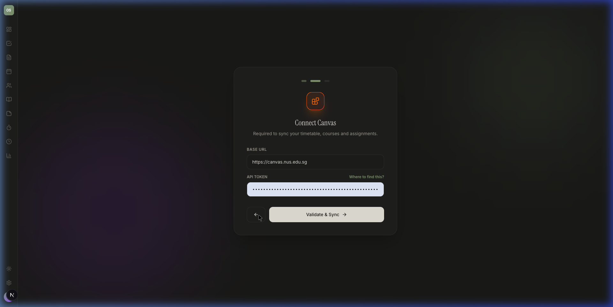

# Onboarding Revamp — Walkthrough

## What Changed

### New Onboarding Flow

The 3-step fixed flow (Canvas → Craft → Telegram) is now a **dynamic 4-step flow** based on user type:

| Step | Standard User | Power User |
|------|--------------|------------|
| 1 | Choose user type | Choose user type |
| 2 | Canvas API (mandatory) | Canvas API (mandatory) |
| 3 | Module verification ✅ | Module verification ✅ |
| 4 | — (Finish) | Craft + Telegram integrations |

### Canvas Step — Mandatory

The "Skip Canvas Sync" button is removed. Canvas is now required for all users.

After validation, the backend performs a course sync and returns the list for verification.

### Module Verification Step

After Canvas sync, users see their modules with checkboxes:
- All modules checked by default
- Users can uncheck irrelevant modules (old courses, administrative entries)
- "Select all" and "Clear" controls available

### Courses Page — Hide/Show Toggles

Each course card now has a **Hide/Show** button in the footer, alongside Tasks, Notes, and Canvas links.

---

## Files Changed

### Backend
| File | Change |
|------|--------|
| [user.py](file:///Users/oli/Desktop/CraftCanvas/backend/models/user.py) | Added `user_type` field |
| [auth.py](file:///Users/oli/Desktop/CraftCanvas/backend/routers/auth.py) | Updated `/me`, `/onboard` to include user_type |
| [courses.py](file:///Users/oli/Desktop/CraftCanvas/backend/routers/courses.py) | Added `PATCH /bulk-active` and `PATCH /{id}/active` |
| [setup.py](file:///Users/oli/Desktop/CraftCanvas/backend/routers/setup.py) | Added `POST /sync-and-list-courses` |

### Frontend
| File | Change |
|------|--------|
| [setup/page.tsx](file:///Users/oli/Desktop/CraftCanvas/frontend/app/setup/page.tsx) | Full rewrite — 4-step dynamic onboarding |
| [courses/page.tsx](file:///Users/oli/Desktop/CraftCanvas/frontend/app/courses/page.tsx) | Hide/Show toggle on cards, "Hidden Modules" label |
| [api.ts](file:///Users/oli/Desktop/CraftCanvas/frontend/lib/api.ts) | Added `patch` method |
| [AuthProvider.tsx](file:///Users/oli/Desktop/CraftCanvas/frontend/components/AuthProvider.tsx) | Added `user_type` to User interface |

## Verification

- ✅ Setup page loads with user type selection (Standard / Power User)
- ✅ Canvas step is mandatory — no skip button
- ✅ Step indicators adjust dynamically (3 for Standard, 4 for Power)
- ✅ Courses page shows Hide/Show toggle on each card
- ✅ "Active only" filter with Eye/EyeOff icons works
- ✅ Backend starts without errors
